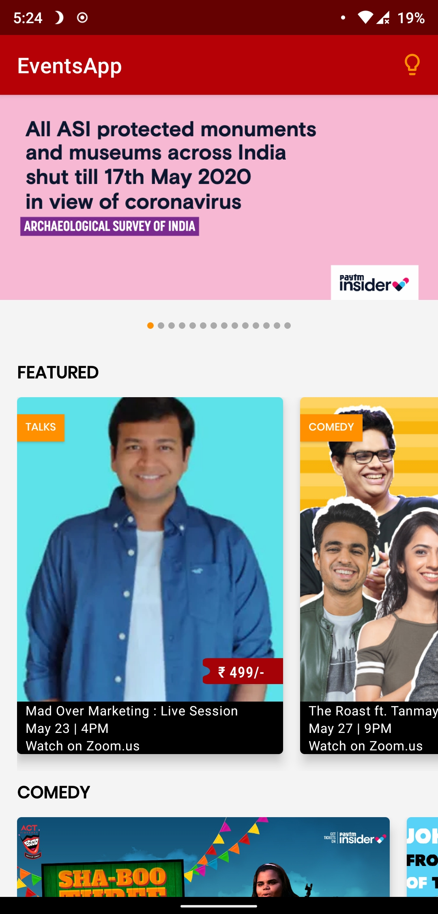
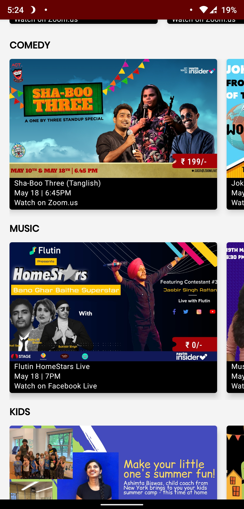
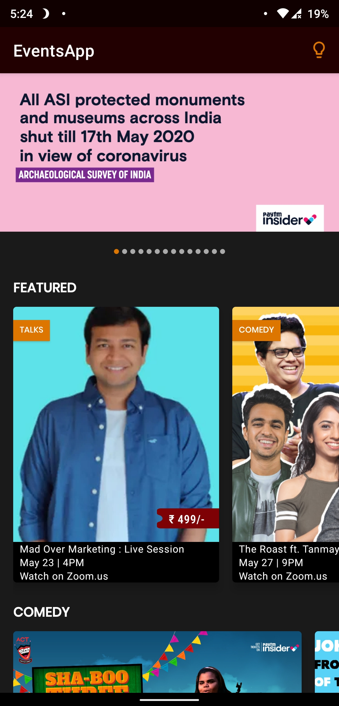
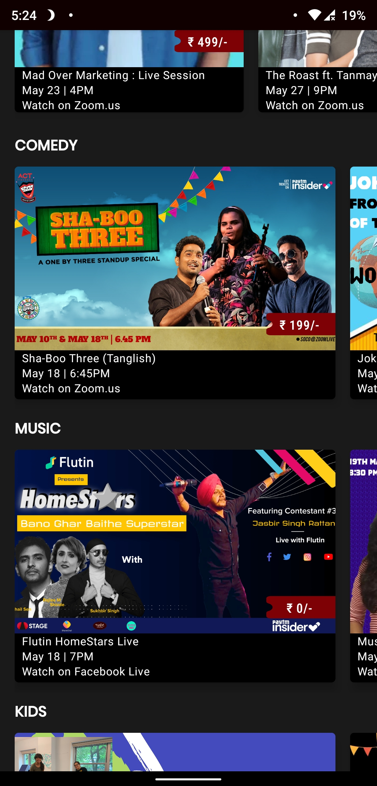

# EventsApp
An eventsApp which showcases the current event going on in the City(Mumbai).

***You can Install and test latest Events app from below 👇***

<table style="width:100%">
  <tr>
    <th>Screen_LIGHT_1</th>
    <th>Screen_LIGHT_2</th>
    <th>Screen_DARK_1(Dark Mode 🌗)</th>
    <th>Screen_DARK_2</th>
  </tr>
  <tr>
    <td></td>
    <td></td>
    <td></td>
    <td></td>
  </tr>
</table>

## About
- It simply loads **Ongoing/Upcoming Events in Mumbai** from [Insider API](https://api.insider.in/home?norm=1&filterBy=go-out&city=mumbai)
- It shows Featured Events with Music, Comedy genres included
- Dark mode too 🌗.
- It is offline capable (Using Okhttp Cache).

## Built With 🛠
- [Kotlin](https://kotlinlang.org/) - First class and official programming language for Android development.
- [Coroutines](https://kotlinlang.org/docs/reference/coroutines-overview.html) - For asynchronous and more..
- [Flow](https://kotlin.github.io/kotlinx.coroutines/kotlinx-coroutines-core/kotlinx.coroutines.flow/-flow/) - A cold asynchronous data stream that sequentially emits values and completes normally or with an exception.
- [Android Architecture Components](https://developer.android.com/topic/libraries/architecture) - Collection of libraries that help you design robust, testable, and maintainable apps.
  - [LiveData](https://developer.android.com/topic/libraries/architecture/livedata) - Data objects that notify views when the underlying database changes.
  - [ViewModel](https://developer.android.com/topic/libraries/architecture/viewmodel) - Stores UI-related data that isn't destroyed on UI changes.
  - [ViewBinding](https://developer.android.com/topic/libraries/view-binding) - Generates a binding class for each XML layout file present in that module and allows you to more easily write code that interacts with views.
- [Koin](https://start.insert-koin.io/) - Dependency Injection Framework (Kotlin)
- [Retrofit](https://square.github.io/retrofit/) - A type-safe HTTP client for Android and Java.
- [Glide](https://bumptech.github.io/glide/) - A fast and efficient image loading library for Android focused on smooth scrolling.
- [Moshi](https://github.com/square/moshi) - A modern JSON library for Kotlin and Java.
- [Moshi Converter](https://github.com/square/retrofit/tree/master/retrofit-converters/moshi) - A Converter which uses Moshi for serialization to and from JSON.
- [Material Components for Android](https://github.com/material-components/material-components-android) - Modular and customizable Material Design UI components for Android
